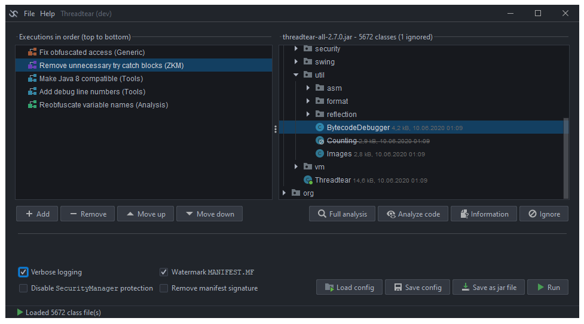
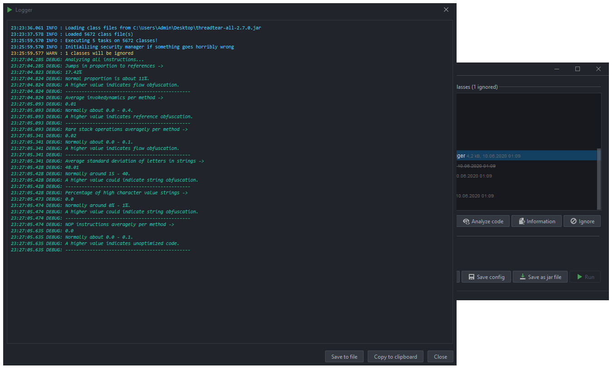
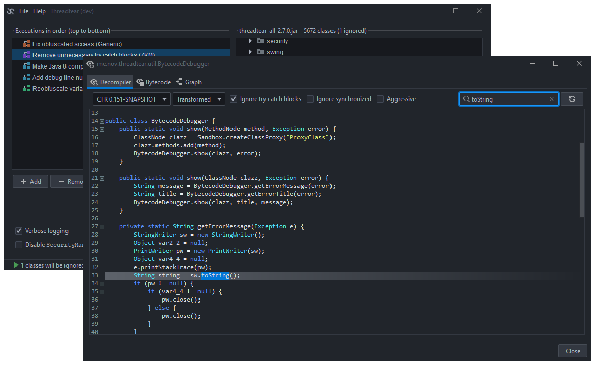
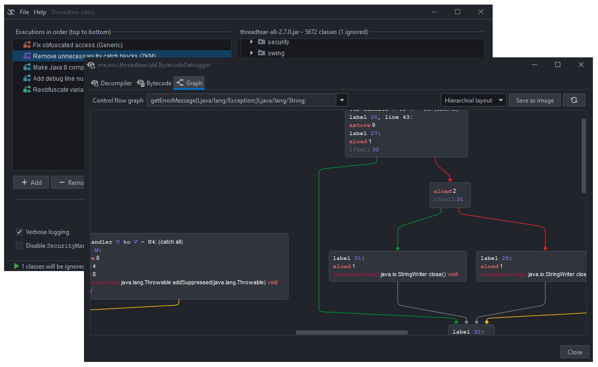
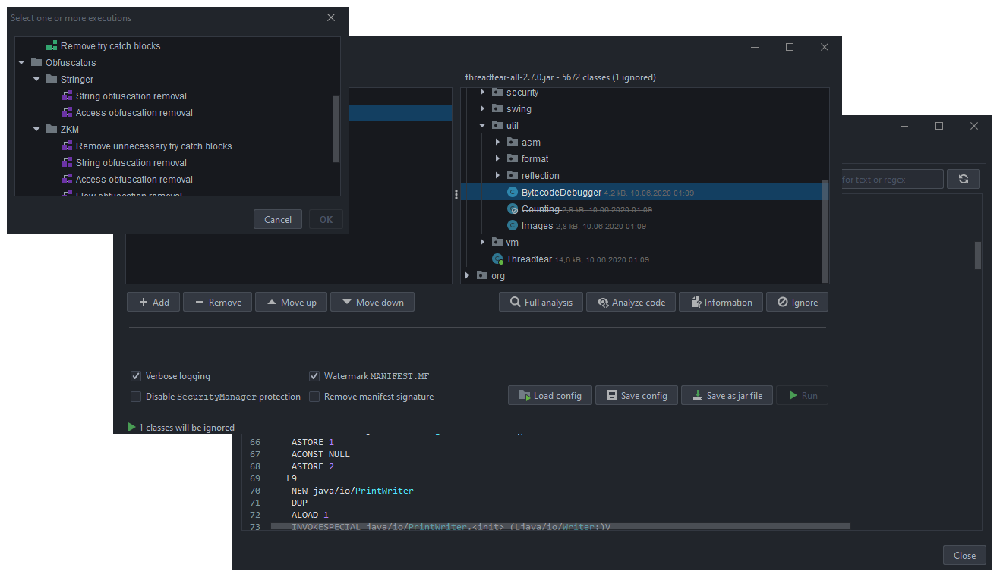

# Threadtear [](https://travis-ci.com/GraxCode/threadtear) [](https://github.com/GraxCode/threadtear/releases) [](https://github.com/GraxCode/threadtear/releases)
Threadtear is a multifunctional deobfuscation tool for java. Android application support is coming soon (Currently working on a dalvik to java converter). 
Suitable for easier code analysis without worrying too much about obfuscation.
Even the most expensive obfuscators like ZKM or Stringer are included. For easier debugging there are other tools included. 
Insert debug line numbers to better understand where exceptions originate, or add .printStackTrace() to try catch blocks without re-compiling your code. 
Reverse compatibility is not a problem anymore, if no version specific methods are used. Analyze code flow in a graph, to better understand algorithms.






## Executions 
An "execution" is a task that is executed and modifies all loaded class files. 
There are multiple types of executions, varying from bytecode cleanup to string deobfuscation. 
Make sure to have them in the right order. Cleanup executions for example should be executed at last, but also can help other executions if executed first.
If you are ready, click on the "Run" button, and they will be executed in order.

## Warning
Use this tool at your own risk. Some executions use implemented ClassLoaders to run code from the jar file. An attacker could tweak the bytecode so that malicious code could be executed.
Affected executions use the class `me.nov.threadtear.asm.vm.VM`. 
These are mostly used for decrypting string or resource / access obfuscation, as it is much easier to execute the decryption methods remotely.
### Security
Threadtear tries its best to protect you from malicious calls (arbitrary code executions) using its own `SecurityManager`, but there is no guarantee. 
Especially with deobfuscators like for ZKM or Stringer you have to be very careful, as reflection has to be allowed, otherwise they would not function.
If you discover an ACE, please open an issue. I will try to fix them as soon as possible.

## How to compile 
First, run `gradle build`, then `gradle fatJar`. In `builds/libs` a runnable jar file should then have been created. If you don't want to download the repo, you can use the latest release.

## Make your own execution
You can easily create your own execution task. Just extend `me.nov.threadtear.execution.Execution`:
```java
public class MyExecution extends Execution {
	public MyExecution() {
		super(ExecutionCategory.CLEANING /* category */, "My execution" /* name */,
				"Executes something" /* description, can use html */);
	}
	/**
	* This method is invoked when the user clicks on the Run button
	* @return true if success, false if failure
	*/
	@Override
	public boolean execute(Map<String, Clazz> classes, boolean verbose) {
		classes.values().stream().map(c -> c.node).forEach(c -> {
			//transform the classes here using the tree-API of ASM
		});
		return false;
	}
}
```
To load ClassNodes at runtime, use the `me.nov.threadtear.asm.vm.VM` class and implement `me.nov.threadtear.asm.vm.IVMReferenceHandler`:
```java
public class MyExecution extends Execution implements IVMReferenceHandler {
	public MyExecution() {
		super(ExecutionCategory.GENERIC, "My execution", "Loads ClassNodes at runtime");
	}
	@Override
	public boolean execute(Map<String, Clazz> classes, boolean verbose) {
		classes.values().stream().map(c -> c.node).forEach(c -> {
			VM vm = VM.constructVM(this);
			//transform bytecode to java.lang.Class
			Class<?> loadedClass = vm.loadClass(c.name.replace('/', '.'), true);
			//do stuff with your class here
			loadedClass.getMethods()[0].invoke(...);
			return true;
		});
	}
	/**
	* Will get invoked by VM, when VM.loadClass is called
	*/
	@Override
	public ClassNode tryClassLoad(String name) {
		//try to find the class to be loaded in open jar archive
		return classes.containsKey(name) ? classes.get(name).node : null;
	}
}
```
Using the ConstantTracker (`me.nov.threadtear.analysis.stack.ConstantTracker`) you can analyze methods and keep track of non-variable stack values. 
If for example `iconst_0` is pushed to the stack, the value itself isn't lost like in the basic ASM analyzer, and you can use it to predict things later on in the code.
```java
public class MyExecution extends Execution implements IConstantReferenceHandler {
	public MyExecution() {
		super(ExecutionCategory.GENERIC, "My execution", "Performs stack analysis and replaces code.");
	}
	@Override
	public boolean execute(Map<String, Clazz> classes, boolean verbose) {
		classes.values().stream().map(c -> c.node).forEach(this::analyzeAndRewrite);
		return true;
	}
	public void analyzeAndRewrite(ClassNode cn) {
		cn.methods.forEach(m -> {
			// this analyzer keeps known stack values, e.g. can be useful for jump prediction
			Analyzer<ConstantValue> a = new Analyzer<ConstantValue>(new ConstantTracker(this, Access.isStatic(m.access), m.maxLocals, m.desc, new Object[0]));
			try {
				a.analyze(cn.name, m);
			} catch (AnalyzerException e) {
				logger.severe("Failed stack analysis in " + cn.name + "." + m.name + ":" + e.getMessage());
				return;
			}
			Frame<ConstantValue>[] frames = a.getFrames();
			InsnList rewrittenCode = new InsnList();
			Map<LabelNode, LabelNode> labels = Instructions.cloneLabels(m.instructions);

			// rewrite method instructions
			for (int i = 0; i < m.instructions.size(); i++) {
				AbstractInsnNode ain = m.instructions.get(i);
				Frame<ConstantValue> frame = frames[i];
				// replace / modify instructions, etc...
				if (frame.getStackSize() > 0) {
					ConstantValue top = frame.getStack(frame.getStackSize() - 1);
					if (top.isKnown() && top.isInteger()) {
						int knownTopStackValue = top.getInteger();
						// use the known stack to remove jumps, simplify code, etc...
						// if(...) { rewrittenCode.add(...); }
						continue;
					}
				}
				rewrittenCode.add(ain.clone(labels));
			}
			// update instructions and fix try catch blocks, local variables, etc...
			Instructions.updateInstructions(m, labels, rewrittenCode);
		});
	}
	/**
	 * Use this method to predict stack values if fields are loaded
	 */
	@Override
	public Object getFieldValueOrNull(BasicValue v, String owner, String name, String desc) {
		return null;
	}
	/**
	 * Use this method to predict stack values if methods are invoked on known objects
	 */
	@Override
	public Object getMethodReturnOrNull(BasicValue v, String owner, String name, String desc, List<? extends ConstantValue> values) {
		if (name.equals("toCharArray") && owner.equals("java/lang/String")) {
			if (!values.get(0).isKnown()) {
				// invocation target is not known, we can't compute the return
				return null;
			}
			return ((String) values.get(0).getValue()).toCharArray();
		}
		return null;
	}
}
```
Don't forget to add your execution to the tree in `me.nov.threadtear.execution.ExecutionLink`!
## Tips & Tricks
There are some tricks that can help you identify and deobfuscate jar files successfully. Before running executions, decompile the code to find out what needs to be used. 
You can use the implemented decompiler for that.
### Deobfuscation order
The best order for a deobfuscation is `generic executions > access deobfuscation > string deobfuscation > cleaning executions`.
### Identification
Obfuscators exhibit patterns which you can use to identify obfuscators. The easiest way to identify an obfuscator is to skim the `META-INF/MANIFEST.MF` file. 
It's possible that there is an `Obfuscated-By: XXX` or `Protected-By: XXX` attribute.

##### ZKM
Extremely (flow-) obfuscated code, often noticeable by a string decryption method in the static initializer containing switches,
 or string decryption methods with a very long switch block (about 250 cases).
ZKM is one of the best (and oldest) obfuscators for java, and very expensive. As ancient as the obfuscator is their website.

##### Stringer
If your jar file contains some special classes with huge decryption algorithms that are used by string obfuscation and access obfuscation, it's probably Stringer.
The protection is not bad and Stringer is one of the most expensive obfuscators. Unlike normal obfuscators it does not come with name obfuscation. 
It is rather used as "second layer". Probably 90% of people that use this obfuscator are using a crack, as it costs more than a car.
If your file has been obfuscated with multiple obfuscators, and Stringer is one of them, you should begin your deobfuscation with Stringer, as Stringer obfuscation cannot be overwritten. 
(Due to custom JAR signature and usage of method names during string decryption)


##### Allatori
Class names like IiIlIlIiIl or aUx, cOn, PrX indicate Allatori obfuscation.
Allatori is very common amongst obfuscated jar files, because it offers a free demo that accessible within a few clicks. The obfuscation is not that hard to reverse.

##### Paramorphism
Paramorphism is like the little brother of stringer, as it looks similar, but isn't as good as it. It also has some interesting features that aim to crash reverse engineering tools, which can be removed easily. 
The obfuscation strength is comparable to Allatori.


##### Other obfuscators
For other obfuscators you can try generic executions or open an issue, and I'll see what I can do.

### Description and tags
Before selecting an execution, check out the tool-tip texts while hovering. 
They contain a small description about what they do, but also tags that help you understand how the behavior of your JAR file will be changed.

## License
Threadtear is licensed under the GNU General Public License 3.0

## Donate
This tool was a ton of work. 
If I saved your time, and you want to buy me a coffee you can do so here: [](https://en.cryptobadges.io/donate/37f6MxNoyyksgh3hWtbh9UKkkGDSAoHCtT)

## Notice
Use Threadtear for legal purposes only. Threadtear is not aiming to be a cracking tool, but rather to be a malware analysis toolkit. 
Please open an issue or email me if a transformer doesn't work properly and attach the log.   
Note that output files are most likely not runnable. If you still want to try to run them use `-noverify` as JVM argument!   
This tool intends to be used with Java 8, but it will probably run on higher versions too. 
